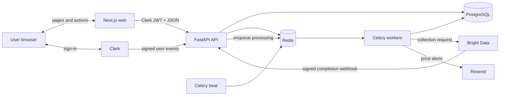
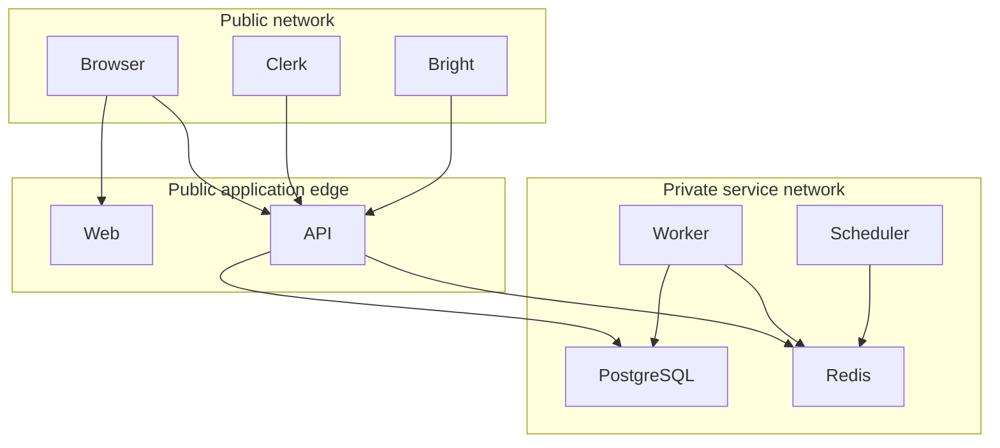
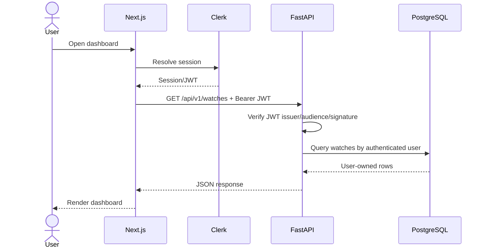
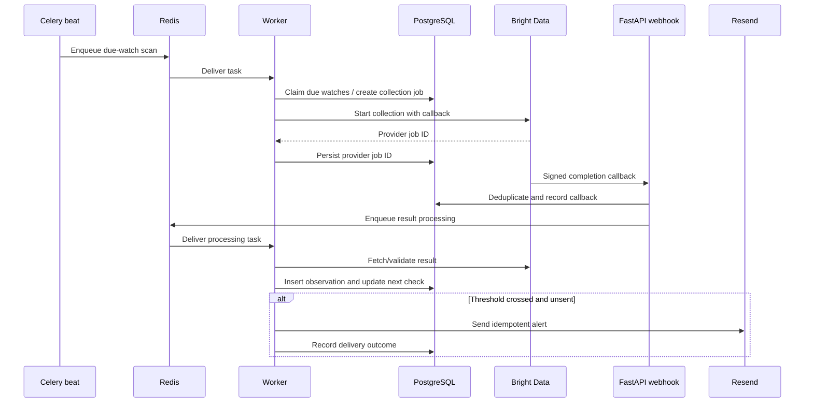

# Architecture

## Goals

PriceTracker provides authenticated users with durable product watches, price
history, scheduled retail-price refreshes, and threshold alerts. The design
keeps HTTP request latency independent of scraping latency, treats PostgreSQL
as the system of record, and makes paid-provider usage measurable and bounded.

## System context

## Components and ownership

- **Next.js (`apps/web`)** renders the product dashboard, watch forms, price
  history, and account UI. It obtains sessions from Clerk and calls the API
  with a bearer token. It is not an authorization boundary.
- **FastAPI (`apps/api`)** validates Clerk JWTs and signed webhooks, enforces
  ownership and plan limits, exposes `/api/v1`, and performs transactional
  state changes.
- **PostgreSQL 18** stores users, products, retailer identifiers, watches,
  collection jobs, observations, and alert-delivery state.
- **Redis** transports Celery messages/results and supports short-lived locks
  or deduplication. Redis data must be disposable without losing business
  records.
- **Celery workers** start/provider-process price collections and send alerts.
  Tasks must be idempotent because delivery is at least once.
- **Celery beat/scheduler** emits due-check jobs. Exactly one scheduler should
  run per environment.
- **Bright Data** performs external retail collection. Tests substitute
  injected mock transports, and a development/test-only fake provider
  (`PRICETRACKER_PRICE_PROVIDER=fake`) serves deterministic synthetic prices;
  it is refused in staging and production.
- **Resend** sends transactional price-alert email. A blank API key selects a
  non-delivering logging provider during development and tests.

## Trust boundaries

Inputs crossing from the public network are untrusted. The API verifies JWT
issuer, audience, signature, expiry, and authorized party as applicable.
Webhook handlers verify signatures against the raw request body, apply a
timestamp/replay window, record provider event identifiers, and acknowledge
duplicates without repeating side effects.

PostgreSQL and Redis are not publicly reachable in production. API, worker,
and scheduler receive only the secrets their roles require. Browser bundles
receive only Clerk's publishable key; the Next.js server uses `API_BASE_URL`
for backend calls.

## Core data model

Names may evolve with implementation, but these invariants should remain:

- a user is mapped uniquely to a Clerk user ID;
- a canonical product can have retailer-specific identities and URLs;
- a watch belongs to one user and references one product/retailer target;
- a price observation records currency, availability, source, observed time,
  and provider provenance;
- a collection job has a provider job ID, status, attempt count, and
  deduplication key;
- an alert delivery references the watch and triggering observation and has a
  unique idempotency key.

Frequently queried foreign keys, due timestamps, provider IDs, and observation
time-series keys require indexes. Retain `createdAt`/`updatedAt` equivalents
and use UTC timestamps throughout.

## Authenticated request flow

The API derives user identity from the verified token. It never accepts a
client-provided owner ID as authority.

## Price-check flow

The scheduler should claim due work in bounded batches. A unique
deduplication key prevents overlapping schedule ticks from purchasing the same
collection twice. Provider callbacks return quickly after validation and
enqueue expensive work.

## Failure and consistency model

- Celery tasks can be retried and delivered more than once; all externally
  visible side effects need idempotency keys.
- Database transactions commit the state transition before acknowledging a
  task. Network calls are never assumed transactional with PostgreSQL.
- Provider timeouts move jobs to a retryable state with capped exponential
  backoff and jitter. Permanent validation failures go to an operator-visible
  terminal state.
- Email failure does not discard the triggering observation. Delivery retries
  are capped and recorded separately.
- `/readyz` fails when required dependencies are unavailable; `/healthz`
  reports only process health.
- Redis loss may delay or require re-enqueuing work, but cannot erase watches,
  observations, or delivery records.

## Scaling

API and worker replicas are stateless and horizontally scalable. Worker
concurrency is constrained first by database capacity and Bright Data spend,
not CPU alone. Run one scheduler, use a managed Redis service with eviction
disabled for queues, and use PostgreSQL connection pooling. Partition or
archive observations only after measured table/index pressure.

## API compatibility

Public application routes are versioned under `/api/v1`. Backward-compatible
fields may be added within a version; removing or reinterpreting fields
requires a new version or a deprecation window. OpenAPI generation should be
deterministic and checked for drift in CI.

